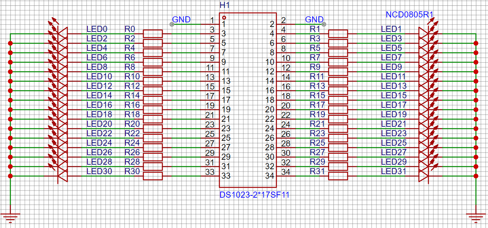

## 5.1 章节导读

本章将实现 PWM（脉宽调制）呼吸灯效果，即控制 LED 灯的亮度在一个周期内从暗到亮再从亮到暗，形成如人呼吸般的灯光变化。通过该实验可以掌握 PWM 占空比调节以及 FPGA 控制 LED 的基本方法。

## 5.2 理论学习

呼吸灯在我们的生活中很常见，在电脑上多作为消息提醒指示灯而被广泛使用，其效果是小灯在一段时间内从完全熄灭的状态逐渐变到最亮，再在同样的时间段内逐渐达到完全熄灭的状态，并循环往复。这种效果就像“呼吸”一样。而实现”呼吸“的方法就是PWM技术。

PWM（Pulse Width Modulation）是一种常用的控制技术，其核心思想是通过控制一个周期内信号为高电平的时间比例（占空比）来实现输出电压或亮度的变化。也就是说只要我们在小时间段内，led灯的亮度依次增加，然后依次减小，即可实现”呼吸“的效果。


## 5.3 实战演练

### 5.3.1 实验目标

实现 LED 呼吸灯效果，亮度逐渐变亮再逐渐变暗，周而复始，整体周期约为2秒，视觉上更加自然流畅。

### 5.3.2 硬件资源

实验板提供 32 颗 LED 灯，本实验选用其中的 1 颗绿色 LED 进行 PWM 控制


通过原理图可以得知，本试验箱的LED灯为高电平时点亮。



### 5.3.3 程序设计

本模块的设计事实上是两个计数器，所以肯定需要时钟信号sysclk，也需要一个rstn复位信号，同时需要一个IO口驱动LED。所以模块的端口如下表所示：

| 端口名称 | 端口位宽               | 端口类型           |功能描述|
|:----------:|:----:|:----:|:--------------------:|
| sysclk | 1Bit | Input | 输入时钟，频率27M |
| rstn | 1Bit | Input | 复位信号，低电平有效 |
| led | 1Bit | Output | LED控制信号 |

为了实现一个视觉上柔和自然的 LED 呼吸效果，我们设定完整的呼吸周期为 2 秒，即 LED 亮度在 1 秒内逐渐增强，接着在另 1 秒内逐渐减弱。整个过程由占空比（duty cycle）的变化来控制 PWM 输出的高电平持续时间。

在本设计中，使用实验板的 27MHz 系统时钟。为了获得合适的 PWM 控制精度，我们将一个 PWM 周期设定为 1ms，这对应 27000 个时钟周期（27M ÷ 1000）。通过一个名为 `pwm_cnt` 的计数器来实现这一周期性计数，当 `pwm_cnt` 小于占空比 `duty` 的值时，LED 输出高电平，从而控制亮度。

为了实现“呼吸”变化，我们再设计另一个计数器 `duty`，它每 1ms（即 `pwm_cnt` 计满一次）更新一次。前 1000ms 内占空比逐渐增加，即 `duty` 每次增加，从而输出高电平的时间逐步变长，LED 亮度逐渐增强；后 1000ms 内占空比逐渐减小，每次减小，LED 亮度逐渐变弱。如此循环往复，即可实现 LED 的“柔和呼吸”效果。

那么，占空比 duty 的变化步长如何选择？考虑到：一个 1ms是 27000 个时钟；如果我们希望1ms内led亮的时间为1us的倍数，那么我们可以将27000分成1000份，一份是27。如果duty的每次增减是27，那么也就对应了led每次亮灭的时间增减了1us。也就是说当duty为27时，led亮的时间为1us，1ms过后，duty变为54，led亮的时间为2us，以此类推，当duty为27000时，led亮满1ms。这样就实现了led亮的时间逐渐增加的效果。

模块的参考代码如下所示（`pwm.v`）：

```verilog
module pwm(
    input wire sysclk,     // 27MHz 系统时钟
    input wire rstn,    // 低有效复位
    output wire led     // PWM 控制LED输出
);

parameter PWM_PERIOD = 16'd27000;//1ms
// 单一PWM周期，1ms
// duty上升的次数是1000次，下降的次数也是1000次，说明pwm的半周期是 1ms * 1000 = 1s
// pwm的一次全周期是 1s * 2 = 2s
reg [15:0] pwm_cnt;
reg [15:0] duty;
reg inc_dec_flag;//0表示duty+ ，1表示duty-
//计数器1，不断累加
always @(posedge sysclk or negedge rstn) begin
    if (!rstn)
        pwm_cnt <= 0;
    else if (pwm_cnt < PWM_PERIOD - 1)
        pwm_cnt <= pwm_cnt + 1;
    else
        pwm_cnt <= 0;
end
//计数器2，控制占空比，单一周期结束进行一次累加或者减
always @(posedge sysclk or negedge rstn) begin
    if (!rstn)
        duty <= 0;
    else if (pwm_cnt == PWM_PERIOD - 1)begin
        if(inc_dec_flag == 0)
            duty <= duty + 27;
        else 
            duty <= duty - 27;
    end
    else duty <= duty;
end
//加减的标志位，半周期结束后反转。
always @(posedge sysclk or negedge rstn) begin
    if(~rstn)
        inc_dec_flag <= 0;
    else if(duty == PWM_PERIOD)
        inc_dec_flag <= 1;
    else if(duty == 0)
        inc_dec_flag <= 0;
    else 
        inc_dec_flag <= inc_dec_flag;
end

assign led = (pwm_cnt < duty) ? 1'b1 : 1'b0;
endmodule
```


### 5.3.4 仿真验证

为了验证模块功能，我们可以编写仿真模块，并将 `PWM_PERIOD` 等比例缩小为270，以便快速验证。以下为仿真文件（`pwm_tb.v`）：

```verilog
`timescale 1ns/1ns
module pwm_tb;

    reg sysclk;
    reg rstn;
    wire led;

    // 实例化待测试模块
    pwm #(
        .PWM_PERIOD(270)//为了减少仿真时间，将单一pwm周期从27000等比例缩小为270
    ) pwm_inst (
        .sysclk(sysclk),
        .rstn(rstn),
        .led(led)
      );
    // 产生系统时钟：周期约为 27Mhz
    initial begin
        sysclk = 0;
        forever #(500/27) sysclk = ~sysclk;
    end

    // 初始化和复位过程
    initial begin
        // 初始化
        rstn = 0;
        #100;           // 保持复位100ns
        rstn = 1;       // 释放复位
    end

endmodule
```

同时为了便于仿真，可以直接点击sim文件夹下hebav文件夹中的do.bat文件即可利用ModuleSim对模块进行仿真，仿真波形如下：


通过观察波形我们发现led输出为1的时间在逐步增加之后逐步减小，duty的值从0增加到270后减小，符合设计预期，可以进行下一步上板验证。

### 5.3.5 上板验证

仿真验证通过后，即可进行上板测试。在实际使用时需要进行管脚约束。以下为参考端口与分配示例：

| 端口名称 | 信号类型 | 对应管脚 | 功能               |
| -------- | -------- | -------- | ------------------ |
| clk      | Input    |          | 27MHz时钟          |
| rstn     | Input    |          | 复位               |
| led      | Output   |          | 输出PWM信号连接LED |

完成管脚绑定后生成 `.sbit` 文件，上传到实验平台后进行烧录，即可在摄像头画面中看到 LED 呼吸闪烁效果。

## 5.4 章末总结

本章我们学习了 PWM 控制的基本原理及其在 LED 呼吸灯上的应用，同时通过不断改变PWM占空比方式使呼吸过程更加平滑自然。该方法不仅适用于视觉灯效控制，还广泛应用于马达调速、音量控制等模拟量调节领域。你可以进一步尝试调整占空比范围、节奏速度，甚至扩展到多个 LED 同步/异步呼吸控制，实现更加炫酷的视觉效果。