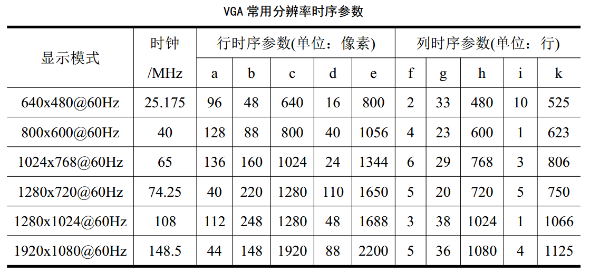
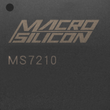
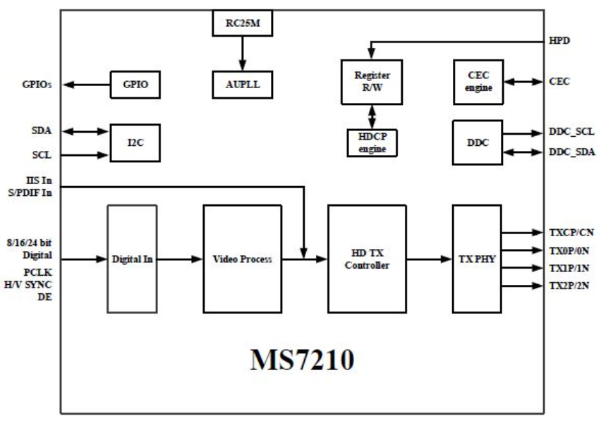
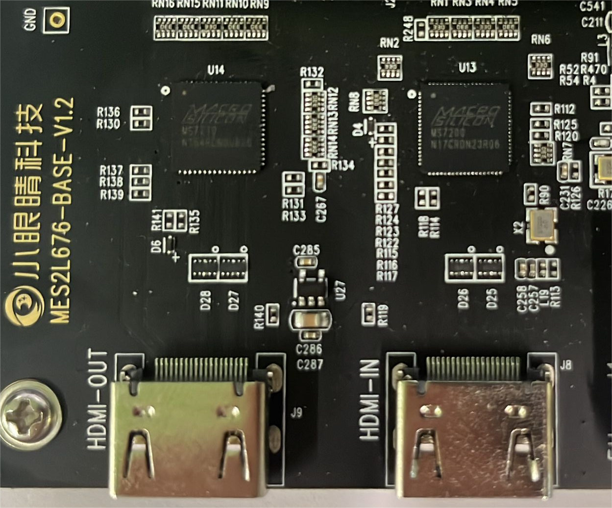

## 6.1 章节导读

随着多媒体技术的快速发展，高清显示已成为嵌入式系统与FPGA应用中不可或缺的一部分。HDMI（High-Definition Multimedia Interface）作为目前最主流的视频数字传输标准，广泛应用于电视、显示器、笔记本、摄像头等各类终端设备中。相比传统的模拟VGA接口，HDMI具有传输带宽高、支持音视频同步、无压缩信号传输等优点，能更好地满足现代图像处理和显示系统的需求。

在FPGA开发中，掌握HDMI显示技术不仅是实现图像/视频输出的基础能力，更是后续图像识别、视频监控、图形用户界面（GUI）等复杂系统设计的前提。因此，本实验以HDMI显示为核心内容，带领大家从零开始构建一个完整的视频输出链路。通过配置显示参数、生成时序控制信号、输出RGB图像数据等关键步骤，最终实现在HDMI接口上稳定输出画面。

在本次实验中我们将学习利用实验板的HDMI接口和MS7210芯片，进行HDMI显示实验的设计。

## 6.2 理论学习

### 6.2.1 VGA时序

VGA显示是在行同步和帧同步（场同步）的信号同步下，按照从上到下，从左到右的顺序，扫描到显示屏上。VGA扫描方式见下图所示：


如上图所示，每一帧图像都是从左上角开始，逐行扫描形成，所以规定最左上角的像素点为第一个像素点，坐标是（0，0），以这个像素为起点，向右x坐标逐渐增大，向下y坐标逐渐增大，重复若干次后扫描到右下角完成一帧图像的扫描，扫描完成后进行图像消隐，随后指针跳回左上角重新进行新一帧的扫描。

 在扫描的过程中会对每一个像素点进行单独赋值，使每个像素点显示对应色彩信息，当扫描速度足够快，加之人眼的视觉暂留特性，我们会看到一幅完整的图片，这就是VGA 显示的原理。

VGA显示除了要有像素点的信息，还需要有行同步（HSync）和场同步（VSync）两个信号辅助显示。行同步信号规定了一行像素的开始与结束，场同步信号规定了一帧图像的开始与结束。在VESA DMT 1.12版本的标准文档中给出的VGA时序图如下图所示：


行同步时序如下图所示：


行同步的一个扫周期要经过6个部分，分别是Sync（同步）、 Back Porch（后沿）、 Left Border（左边框）、 “Addressable” Video（有效图像）、 Right Border（右边框）、 Front Porch（前沿），这些过程的长度都是以像素为单位的，也就是以像素时钟为单位，例如Sync的值为96，也就意味着Sync阶段要经历96个像素时钟。HSync信号会在Sync同步阶段拉高（不同的芯片可能有不同标准）以确定新一行的开始与上一行的结束。而完整的一行像素很多，但有效的真正能显示在屏幕上的像素只有 “Addressable” Video（有效图像）部分的像素，其他阶段的像素均无效，无法显示在屏幕中。

场同步时序如下图所示：


场同步时序与行同步时序相同，也是分为6个部分，在Sync同步阶段拉高，标志着一帧的结束和新一帧的开始，其中像素只有在“Addressable” Video（有效图像）阶段才有效，其他阶段均无效。而场同步信号的基本单位是行，比如Sync的值为2，也就意味着Sync同步阶段要经历两行。

那么我们将行同步和场同步信号结合起来，遍可以得到一帧图像的样貌，如下图所示：


可以看到在行场同步信号构成了一个二维坐标系，原点在左上方，中间遍形成了一帧图像，而真正能显示在屏幕中的图像只有 “Addressable” Video（有效图像）部分。

现在我们知道了行同步和场同步都要经历6个部分，那么这些部分的长度都是如何规定的呢？VGA 行时序对行同步时间、 消隐时间、 行视频有效时间和行前肩时间有特定的规范， 场时序也是如此。 常用VGA 分辨率时序参数如下表所示：



### 6.2.2 MS7210芯片

MS7210是一款HD发送芯片，支持4K@30Hz的视频3D传输格式。可以支持的最高分辨率高达4K@30Hz，最高采样率达到300MHz。MS7210支持YUV和RGB 之间的色彩空间转换，数字接口支持YUV以及RGB格式输入。MS7210的IIS接口以及S/PDIF 接口支持高清音频的传输，其中S/PDIF接口既可以兼容IEC61937标准下的压缩音频传输，同时还支持高比特音频（HBR）的传输，在高比特音频（HBR）模式下，音频采样率最高为768KHz。MS7210的IIC 地址可以根据SA引脚进行选择。当 SA引脚上拉到电源电压或者悬空时，地址为 OxB2。当 SA 引脚连接到 GND 时，地址为0x56。





MS7210芯片可以通过IIC协议对内部寄存器进行配置，有关芯片寄存器配置需要向芯片厂家进行申请。

## 6.3 实战演练

### 6.3.1实验目标

### 6.3.2硬件资源

实验板共有一个HDMI-OUT接口，由MS7210驱动，一个HDMI-IN接口，由MS7200驱动。




实验箱配备一个小型HDMI显示器，该显示器HDMI接口与HDMI-OUT接口连接，图像可以显示在显示屏中，通过摄像头可以在网站观察现象


### 6.3.3程序设计

在设计程序时，我们先对本实验工程有一个整体认知，首先来看一下HDMI彩条显示实验的整体框图。


可见整个实验一共由好多个模块组成，下面是各个模块简介：

| 模块名称 |功能描述| 备注 |
|:----:|:----:|:----:|
| hdmi_top | 顶层模块 ||
| ms7210_ctrl_iic_top | ms7210芯片配置和iic顶层模块 |*参考小眼睛例程*|
| ms7210_ctl | ms7210芯片配置和时序控制模块 |*使用小眼睛例程*|
| iic_dri | iic驱动模块 |*使用小眼睛例程*|
| vga_ctrl | vga时序信号生成模块 |*参考野火例程*|
| vga_pic | vga像素数据生成模块 |*参考野火例程*|

本次实验主要完成vga_ctrl和vga_pic模块的设计。

对于vga_ctrl模块，我们主要完成hsync，vsync信号，xy坐标，数据有效rgb_valid信号的设计。经过我们前面的学习已经对vga时序有了一定的了解，我们可以想象到这几个信号也只是一种计数器而已。

本实验要实现640x480的彩条显示，相关参数如下所示：

```Verilog
//parameter define
parameter H_SYNC    =   10'd96  ,   //行同步
          H_BACK    =   10'd40  ,   //行时序后沿
          H_LEFT    =   10'd8   ,   //行时序左边框
          H_VALID   =   10'd640 ,   //行有效数据
          H_RIGHT   =   10'd8   ,   //行时序右边框
          H_FRONT   =   10'd8   ,   //行时序前沿
          H_TOTAL   =   10'd800 ;   //行扫描周期
parameter V_SYNC    =   10'd2   ,   //场同步
          V_BACK    =   10'd25  ,   //场时序后沿
          V_TOP     =   10'd8   ,   //场时序上边框
          V_VALID   =   10'd480 ,   //场有效数据
          V_BOTTOM  =   10'd8   ,   //场时序下边框
          V_FRONT   =   10'd2   ,   //场时序前沿
          V_TOTAL   =   10'd525 ;   //场扫描周期
```

首先设计两个计数器`cnt_h`和`cnt_v`分别对像素和行进行计数，一个像素时钟过后`cnt_h`加一，一行过后`cnt_v`加一，扫描完一帧之后，计数器归零。

而其他的状态信号则可以根据计数器的计数进行设计。hsync信号只要`cnt_h < H_SYNC`就拉高，vsync信号类似。当计数到有效数据部分数据有效信号rgb_valid就可以拉高，注意，由于时序逻辑有一个时钟周期的反应时间，所以xy的坐标变化比rgb_valid提前一个时钟周期。参考代码如下所示：

```verilog
`timescale  1ns/1ns
////////////////////////////////////////////////////////////////////////
// Author        : EmbedFire
// 实验平台: 野火FPGA系列开发板
// 公司    : http://www.embedfire.com
// 论坛    : http://www.firebbs.cn
// 淘宝    : https://fire-stm32.taobao.com
////////////////////////////////////////////////////////////////////////

module  vga_ctrl
(
    input   wire            vga_clk     ,   //输入工作时钟,频率25MHz
    input   wire            sys_rst_n   ,   //输入复位信号,低电平有效
    input   wire    [15:0]  pix_data    ,   //输入像素点色彩信息

    output  wire    [11:0]  pix_x       ,   //输出VGA有效显示区域像素点X轴坐标
    output  wire    [11:0]  pix_y       ,   //输出VGA有效显示区域像素点Y轴坐标
    output  wire            hsync       ,   //输出行同步信号
    output  wire            vsync       ,   //输出场同步信号
    output  wire            rgb_valid   ,
    output  wire    [15:0]  rgb             //输出像素点色彩信息
);

//********************************************************************//
//****************** Parameter and Internal Signal *******************//
//********************************************************************//
//parameter define
parameter H_SYNC    =   10'd96  ,   //行同步
          H_BACK    =   10'd40  ,   //行时序后沿
          H_LEFT    =   10'd8   ,   //行时序左边框
          H_VALID   =   10'd640 ,   //行有效数据
          H_RIGHT   =   10'd8   ,   //行时序右边框
          H_FRONT   =   10'd8   ,   //行时序前沿
          H_TOTAL   =   10'd800 ;   //行扫描周期
parameter V_SYNC    =   10'd2   ,   //场同步
          V_BACK    =   10'd25  ,   //场时序后沿
          V_TOP     =   10'd8   ,   //场时序上边框
          V_VALID   =   10'd480 ,   //场有效数据
          V_BOTTOM  =   10'd8   ,   //场时序下边框
          V_FRONT   =   10'd2   ,   //场时序前沿
          V_TOTAL   =   10'd525 ;   //场扫描周期

//wire  define
wire            pix_data_req    ;   //像素点色彩信息请求信号

//reg   define
reg     [11:0]  cnt_h           ;   //行同步信号计数器
reg     [11:0]  cnt_v           ;   //场同步信号计数器

//********************************************************************//
//***************************** Main Code ****************************//
//********************************************************************//

//cnt_h:行同步信号计数器
always@(posedge vga_clk or negedge sys_rst_n)
    if(sys_rst_n == 1'b0)
        cnt_h   <=  12'd0   ;
    else    if(cnt_h == H_TOTAL - 1'd1)
        cnt_h   <=  12'd0   ;
    else
        cnt_h   <=  cnt_h + 1'd1   ;

//hsync:行同步信号
assign  hsync = (cnt_h  <=  H_SYNC - 1'd1) ? 1'b1 : 1'b0  ;

//cnt_v:场同步信号计数器
always@(posedge vga_clk or negedge sys_rst_n)
    if(sys_rst_n == 1'b0)
        cnt_v   <=  12'd0 ;
    else    if((cnt_v == V_TOTAL - 1'd1) &&  (cnt_h == H_TOTAL-1'd1))
        cnt_v   <=  12'd0 ;
    else    if(cnt_h == H_TOTAL - 1'd1)
        cnt_v   <=  cnt_v + 1'd1 ;
    else
        cnt_v   <=  cnt_v ;

//vsync:场同步信号
assign  vsync = (cnt_v  <=  V_SYNC - 1'd1) ? 1'b1 : 1'b0  ;

//rgb_valid:VGA有效显示区域
assign  rgb_valid = (((cnt_h >= H_SYNC + H_BACK + H_LEFT)
                    && (cnt_h < H_SYNC + H_BACK + H_LEFT + H_VALID))
                    &&((cnt_v >= V_SYNC + V_BACK + V_TOP)
                    && (cnt_v < V_SYNC + V_BACK + V_TOP + V_VALID)))
                    ? 1'b1 : 1'b0;

//pix_data_req:像素点色彩信息请求信号,超前rgb_valid信号一个时钟周期
assign  pix_data_req = (((cnt_h >= H_SYNC + H_BACK + H_LEFT - 1'b1)
                    && (cnt_h < H_SYNC + H_BACK + H_LEFT + H_VALID - 1'b1))
                    &&((cnt_v >= V_SYNC + V_BACK + V_TOP)
                    && (cnt_v < V_SYNC + V_BACK + V_TOP + V_VALID)))
                    ? 1'b1 : 1'b0;

//pix_x,pix_y:VGA有效显示区域像素点坐标
assign  pix_x = (pix_data_req == 1'b1)
                ? (cnt_h - (H_SYNC + H_BACK + H_LEFT - 1'b1)) : 12'hfff;
assign  pix_y = (pix_data_req == 1'b1)
                ? (cnt_v - (V_SYNC + V_BACK + V_TOP)) : 12'hfff;

//rgb:输出像素点色彩信息
assign  rgb = (rgb_valid == 1'b1) ? pix_data : 16'b0 ;

endmodule
```

对于vga_pic模块，我们可以根据x坐标范围（0~639）分成十份，每一份输出不同的颜色。参考代码如下所示：

```verilog
`timescale  1ns/1ns
////////////////////////////////////////////////////////////////////////
// Author        : EmbedFire
// 实验平台: 野火FPGA系列开发板
// 公司    : http://www.embedfire.com
// 论坛    : http://www.firebbs.cn
// 淘宝    : https://fire-stm32.taobao.com
////////////////////////////////////////////////////////////////////////

module  vga_pic
(
    input   wire            vga_clk     ,   //输入工作时钟,频率25MHz
    input   wire            sys_rst_n   ,   //输入复位信号,低电平有效
    input   wire    [11:0]  pix_x       ,   //输入VGA有效显示区域像素点X轴坐标
    input   wire    [11:0]  pix_y       ,   //输入VGA有效显示区域像素点Y轴坐标

    output  reg     [15:0]  pix_data        //输出像素点色彩信息
);

//********************************************************************//
//****************** Parameter and Internal Signal *******************//
//********************************************************************//
//parameter define
parameter   H_VALID =   12'd640 ,   //行有效数据
            V_VALID =   12'd480 ;   //场有效数据

parameter   RED     =   16'hF800,   //红色
            ORANGE  =   16'hFC00,   //橙色
            YELLOW  =   16'hFFE0,   //黄色
            GREEN   =   16'h07E0,   //绿色
            CYAN    =   16'h07FF,   //青色
            BLUE    =   16'h001F,   //蓝色
            PURPPLE =   16'hF81F,   //紫色
            BLACK   =   16'h0000,   //黑色
            WHITE   =   16'hFFFF,   //白色
            GRAY    =   16'hD69A;   //灰色

//********************************************************************//
//***************************** Main Code ****************************//
//********************************************************************//
//pix_data:输出像素点色彩信息,根据当前像素点坐标指定当前像素点颜色数据
always@(posedge vga_clk or negedge sys_rst_n)
    if(sys_rst_n == 1'b0)
        pix_data    <= 16'd0;
    else    if((pix_x >= 0) && (pix_x < (H_VALID/10)*1))
        pix_data    <=  RED;
    else    if((pix_x >= (H_VALID/10)*1) && (pix_x < (H_VALID/10)*2))
        pix_data    <=  ORANGE;
    else    if((pix_x >= (H_VALID/10)*2) && (pix_x < (H_VALID/10)*3))
        pix_data    <=  YELLOW;
    else    if((pix_x >= (H_VALID/10)*3) && (pix_x < (H_VALID/10)*4))
        pix_data    <=  GREEN;
    else    if((pix_x >= (H_VALID/10)*4) && (pix_x < (H_VALID/10)*5))
        pix_data    <=  CYAN;
    else    if((pix_x >= (H_VALID/10)*5) && (pix_x < (H_VALID/10)*6))
        pix_data    <=  BLUE;
    else    if((pix_x >= (H_VALID/10)*6) && (pix_x < (H_VALID/10)*7))
        pix_data    <=  PURPPLE;
    else    if((pix_x >= (H_VALID/10)*7) && (pix_x < (H_VALID/10)*8))
        pix_data    <=  BLACK;
    else    if((pix_x >= (H_VALID/10)*8) && (pix_x < (H_VALID/10)*9))
        pix_data    <=  WHITE;
    else    if((pix_x >= (H_VALID/10)*9) && (pix_x < H_VALID))
        pix_data    <=  GRAY;
    else
        pix_data    <=  BLACK;

endmodule
```

在顶层模块，我们首先要利用PLL ip核生成iic的驱动时钟进行初始化，由于ms7210芯片的需要，我们通过计数设置一个延迟复位信号，由于我们的彩条颜色是按照RGB565格式生成的，所以需要向RGB888进行转换，只需要填0补位即可，同时由于板载时钟是27M与25.175M相差不大，所以直接使用板载时钟作为像素时钟输出。然后我们将输出的行场同步信号，像素时钟，像素数据，像素数据有效信号等与模块相连接即可完成设计。顶层模块参考代码如下：

```Verilog
`timescale 1ns / 1ns
module hdmi_top(
    input wire          sys_clk       ,// input system clock 50MHz   
    input               rstn_in       , 
    output              rstn_out      ,
    output              hd_scl        ,
    inout               hd_sda        ,
    output              led_int       ,

//hdmi_out 
    output              pixclk_out    ,//pixclk                           
    output  wire        vs_out        , 
    output  wire        hs_out        , 
    output  wire        de_out        ,
    output  wire [7:0]  r_out         , 
    output  wire [7:0]  g_out         , 
    output  wire [7:0]  b_out         

);
wire                        cfg_clk    ;
wire                        locked     ;
wire                        rstn       ;
wire                        init_over  ;
reg  [15:0]                 rstn_1ms   ;
//**********************************************//
//*****************MS7210初始化******************//
//**********************************************//
//**************仿真时不编译此部分***************//
`ifndef SIM
//初始化成功标志
assign    led_int    =     init_over;
//生成10M IIC时钟
PLL u_pll (
  .clkout0(cfg_clk),    // output
  .lock(locked),          // output
  .clkin1(sys_clk)       // input
);
//ms7210初始化模块
ms7210_ctrl_iic_top ms7210_ctrl_iic_top_inst(
    .clk         (  cfg_clk    ), //input       clk,
    .rst_n       (  rstn_out   ), //input       rstn,
                        
    .init_over   (  init_over  ), //output      init_over,
    .iic_scl     (  hd_scl    ), //output      iic_scl,
    .iic_sda     (  hd_sda    )  //inout       iic_sda
);
//延迟复位
always @(posedge cfg_clk)
begin
	if(!locked)
	    rstn_1ms <= 16'd0;
	else
	begin
		if(rstn_1ms == 16'h2710)
		    rstn_1ms <= rstn_1ms;
		else
		    rstn_1ms <= rstn_1ms + 1'b1;
	end
end
assign rstn_out = (rstn_1ms == 16'h2710) && rstn_in;
//**********************************************//
`else
assign led_int  =     1;
assign rstn_out = rstn_in;

`endif
//**********************************************//
//**********************************************//
//**********************************************//
//**********************************************//
wire [15:0] rgb565;
wire [15:0] pix_data ;
wire [11:0] pix_x;
wire [11:0] pix_y;
//vga行场同步控制模块
vga_ctrl  vga_ctrl_inst (
    .vga_clk        (sys_clk        ),
    .sys_rst_n      (rstn_out       ),
    .pix_data       (pix_data       ),
    .pix_x          (pix_x          ),
    .pix_y          (pix_y          ),
    .hsync          (hs_out         ),
    .vsync          (vs_out         ),
    .rgb_valid      (de_out         ),
    .rgb            (rgb565         )
  );
//彩条数据生成模块
vga_pic  vga_pic_inst (
    .vga_clk        (sys_clk        ),
    .sys_rst_n      (rstn_out       ),
    .pix_x          (pix_x          ),
    .pix_y          (pix_y          ),
    .pix_data_out   (pix_data       )
  );
//RGB565转RGB888
    assign pixclk_out   =  sys_clk    ;//直接使用27M时钟，与25.175相差不大
    assign r_out = {rgb565[15:11],3'b0};
    assign g_out = {rgb565[10: 5],2'b0};
    assign b_out = {rgb565[ 4: 0],3'b0};
endmodule
```


### 6.3.4仿真验证

由于仿真不需要对MS7210芯片进行初始化，所以我们在top文件中加入条件编译指令，并且在仿真文件中定义SIM宏，那么就可以在仿真中不编译ms7210初始化相关代码，只对vga时序进行仿真。我们只需要提供时钟和复位，即可对模块进行仿真。仿真文件如下所示：

```verilog
`timescale 1ns / 1ns
`define SIM
module hdmi_top_tb;

  // Parameters

  //Ports
  reg  sys_clk;
  reg rstn_in;
  wire rstn_out;
  wire hd_scl;
  wire hd_sda;
  wire led_int;
  wire pixclk_out;
  wire  vs_out;
  wire  hs_out;
  wire  de_out;
  wire [7:0] r_out;
  wire [7:0] g_out;
  wire [7:0] b_out;

  initial begin
    sys_clk = 0;
    rstn_in = 0;
    #100
    rstn_in = 1;
  end
  always #(500/27) sys_clk = ~sys_clk;
  hdmi_top  hdmi_top_inst (
    .sys_clk(sys_clk),
    .rstn_in(rstn_in),
    .rstn_out(rstn_out),
    .hd_scl(hd_scl),
    .hd_sda(hd_sda),
    .led_int(led_int),
    .pixclk_out(pixclk_out),
    .vs_out(vs_out),
    .hs_out(hs_out),
    .de_out(de_out),
    .r_out(r_out),
    .g_out(g_out),
    .b_out(b_out)
  );

endmodule
```

直接点击sim文件夹下hebav文件夹中的do.bat文件即可利用ModuleSim对模块进行仿真，仿真波形如下：


从上图我们可以发现vsync信号拉高了两个行同步信号的长度，与设计相符


从图11和12中我们可以看到当cnt_h信号计数结束后会恢复0，cnt_v会加一，hsync信号会拉高96个像素时钟（0~95）cnt_h和hsync与设计相符。


如图13所示，当cnt_h计数到H_SYNC + H_BACK + H_LEFT，也就是144时，rgb_valid拉高，xy轴坐标比rgb_valid提前一个时钟周期，以便pix_data准备好数据，符合设计。


从每一行看，每一行被分成了10个部分，每部分像素数据分别对应不同颜色，符合设计要求。可以进行下一步上板验证。

### 6.3.5上板验证

仿真已经通过，可以进行上板验证，上板前要先进行管脚约束。端口与对应管脚如下表所示：

| 端口名称 |信号类型| 对应管脚|功能|
|:----:|:----:|:----:|:----:|
| sysclk | Input | D18 | 27M时钟 |
|  rstn_in   | Input | C22 | 外部输入复位 |
| rstn_out | Output | G25 | 输出ms7210复位 |
| hd_scl | Output | K22 | iic SCL信号 |
| hd_sda | Output | K23 | iic SDA信号 |
| led_int | Output | A20 | 配置完成信号 |
| pixclk_out | Output | G25 | 像素时钟输出 |
| vs_out | Output | R21 | Vsync输出 |
| hs_out | Output | R20 | Hsync输出 |
| de_out | Output | N19 | RGB_valid输出 |
| r_out[0] | Output | N21 | RGB888输出 |
| r_out[1] | Output | L23 | RGB888输出 |
| r_out[2] | Output | L22 | RGB888输出 |
| r_out[3] | Output | L25 | RGB888输出 |
| r_out[4] | Output | L24 | RGB888输出 |
| r_out[5] | Output | K26 | RGB888输出 |
| r_out[6] | Output | K25 | RGB888输出 |
| r_out[7] | Output | P16 | RGB888输出 |
| g_out[0] | Output | T25 | RGB888输出 |
| g_out[1] | Output | P25 | RGB888输出 |
| g_out[2] | Output | R25 | RGB888输出 |
| g_out[3] | Output | P24 | RGB888输出 |
| g_out[4] | Output | P23 | RGB888输出 |
| g_out[5] | Output | N24 | RGB888输出 |
| g_out[6] | Output | N23 | RGB888输出 |
| g_out[7] | Output | N22 | RGB888输出 |
| b_out[0] | Output | P19 | RGB888输出 |
| b_out[1] | Output | P21 | RGB888输出 |
| b_out[2] | Output | P20 | RGB888输出 |
| b_out[3] | Output | M22 | RGB888输出 |
| b_out[4] | Output | M21 | RGB888输出 |
| b_out[5] | Output | N18 | RGB888输出 |
| b_out[6] | Output | R22 | RGB888输出 |
| b_out[7] | Output | T22 | RGB888输出 |


管脚分配可以直接编写.fdc文件，也可以使用PDS内置的工具进行分配。完成管脚分配之后就可以生成sbit文件，将文件提交到网站后点击烧录，即可将sbit下载到实验板中，在摄像头页面即可观察到显示屏中显示出彩条。

## 6.4 章末总结

本次实验主要学习VGA时序的相关知识，并使用HD硬核进行HDMI显示，感兴趣的同学可以尝试使用HDMI显示其他图像。